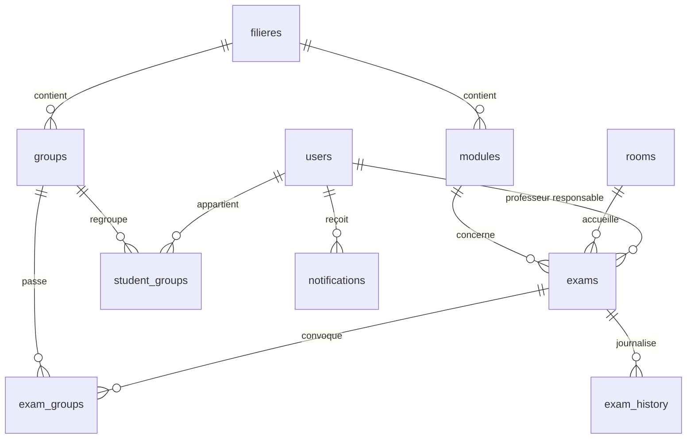

# Architecture : planification des examens

## 1. Décisions clés

| Décision | Choix | Pourquoi |
|---|---|---|
| Où bloquer les conflits ? | **Dans PostgreSQL** (`EXCLUDE USING gist`) | Deux requêtes simultanées ne peuvent pas toutes les deux passer. Une vérification faite seulement dans le code a une fenêtre de concurrence. |
| Intervalle de temps | `tstzrange [début, fin[` | La fin est exclue : 08h-10h et 10h-12h ne sont pas en conflit. |
| Examen annulé | Exclu des contraintes (`WHERE status <> 'cancelled'`) | Une annulation libère la salle. |
| Conflit de groupe | Table `exam_groups` avec copie de l'intervalle, synchronisée par trigger | PostgreSQL ne sait pas écrire une contrainte d'exclusion à travers une jointure. |
| Historique | Trigger sur `exams` → `exam_history` (JSONB avant/après) | Impossible de contourner l'historique en oubliant un appel dans le code. |
| ORM | Prisma pour les requêtes, **migration SQL brute** pour les contraintes | Prisma ne sait pas exprimer les `EXCLUDE` dans son schéma. |

## 2. Modèle de données



Le fichier de référence est `db/schema.sql`.

## 3. Flux principal : changement de salle par un professeur

```mermaid
sequenceDiagram
  participant P as Professeur (mobile)
  participant API as API NestJS
  participant DB as PostgreSQL
  participant N as Notifications
  P->>API: PATCH /exams/:id { roomId }
  API->>DB: BEGIN; set_config('app.user_id', ...)
  API->>DB: UPDATE exams SET room_id = ...
  alt salle déjà occupée
    DB-->>API: erreur 23P01 (exclusion_violation)
    API->>DB: ROLLBACK
    API->>DB: requête "salles libres"
    API-->>P: 409 + salles alternatives
  else salle libre
    DB-->>API: OK (+ ligne dans exam_history via trigger)
    API->>DB: COMMIT
    API->>N: notifier étudiants du groupe + scolarité
    API-->>P: 200
  end
```

## 4. Requête "salles libres" (suggestion)

```sql
SELECT r.id, r.name, r.capacity
FROM rooms r
WHERE r.is_active
  AND r.capacity >= :needed
  AND NOT EXISTS (
    SELECT 1 FROM exams e
    WHERE e.room_id = r.id
      AND e.status <> 'cancelled'
      AND e.during && tstzrange(:start, :end, '[)')
  )
ORDER BY r.capacity;   -- la plus petite salle suffisante d'abord
```

`needed` = somme de `student_count` des groupes de l'examen. Ce contrôle de capacité est fait dans l'API (avertissement ou refus), pas dans la base, car la règle peut avoir des exceptions.

## 5. API (MVP)

| Méthode | Route | Rôle |
|---|---|---|
| POST | `/auth/login`, `/auth/refresh` | tous |
| GET | `/rooms`, `/rooms/available?start=&end=&min=` | scolarité, admin |
| POST/PATCH | `/exams`, `/exams/:id` | scolarité (tout), professeur (ses examens seulement) |
| GET | `/exams/:id/history` | scolarité, admin |
| GET | `/me/schedule` | étudiant (ses groupes seulement) |
| GET | `/notifications` | tous |

Erreur métier : `409 Conflict` avec le type de conflit (`ROOM`, `PROFESSOR`, `GROUP`) déduit du nom de la contrainte violée.

## 6. Structure du repo

```
exam-planner/
├── apps/
│   ├── web/           # Next.js (mobile-first, page publique étudiants)
│   └── api/           # NestJS + Prisma
├── db/
│   ├── schema.sql
│   └── tests/conflicts.sql
├── docs/              # problem.md, research.md, architecture.md
├── docker-compose.yml
└── .github/workflows/
```

## 7. Tests à écrire

- **Base** : `db/tests/conflicts.sql` (salle, professeur, groupe, examens consécutifs, annulation, historique).
- **Concurrence** : lancer 20 requêtes parallèles pour la même salle et le même créneau, vérifier qu'une seule réussit.
- **API** : 409 avec le bon type de conflit, un étudiant ne voit que ses groupes, un professeur ne modifie pas l'examen d'un autre.
- **Fuseaux horaires** : examen à cheval sur minuit, changement d'heure.

## 8. Hors MVP

Générateur automatique (OR-Tools), surveillants, notifications WhatsApp/Telegram, intégration au système de la faculté.

## 9. Données

Uniquement des données fictives. Aucune donnée réelle d'étudiants ou de professeurs dans le dépôt.
